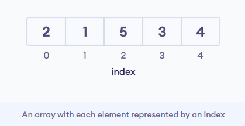
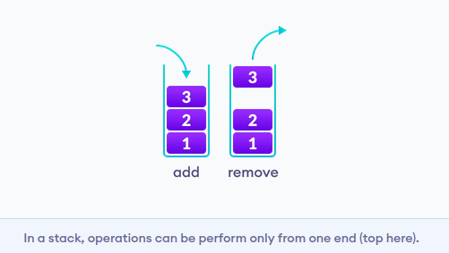
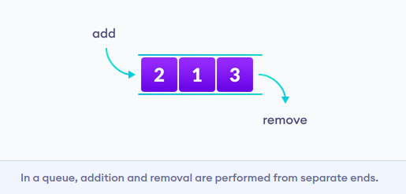
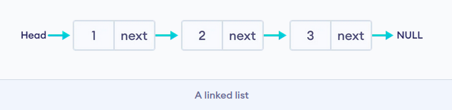
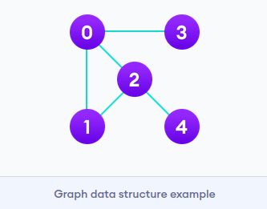
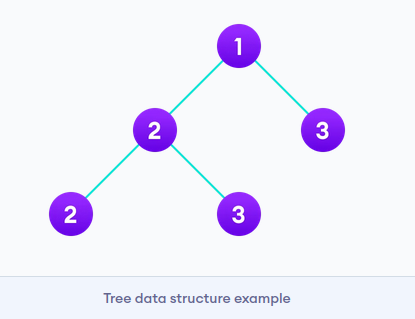

# Data Structure and Types

Data structure is a storage that is used to store and organize data. It is a way of arranging data on a computer so that it can be accessed and updated efficiently.

### Types of Data Structure

Data structures are divided into two categories:

* Linear data structure
* Non-linear data structure

Let's learn about each type in detail.

## Linear data structures

In linear data structures, the elements are arranged in sequence one after the other. Since elements are arranged in particular order, they are easy to implement.

### 1. Array Data Structure

In an array, elements in memory are arranged in continuous memory. 

### 2. Stack Data Structure

In stack data structure, elements are stored in the LIFO principle. That is, the last element stored in a stack will be removed first.

### 3. Queue Data Structure

Unlike stack, the queue data structure works in the FIFO principle where first element stored in the queue will be removed first.

### 4. Linked List Data Structure

In linked list data structure, data elements are connected through a series of nodes. And, each node contains the data items and address to the next node.

## Non linear data structures

Unlike linear data structures, elements in non-linear data structures are not in any sequence. Instead they are arranged in a hierarchical manner where one element will be connected to one or more elements.

### 1. Graph Data Structure

In graph data structure, each node is called vertex and each vertex is connected to other vertices through edges.

### 2. Trees Data Structure

Similar to a graph, a tree is also a collection of vertices and edges. However, in tree data structure, there can only be one edge between two vertices.

