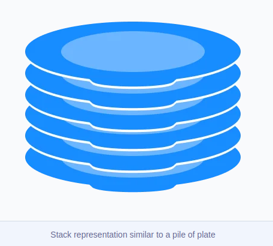
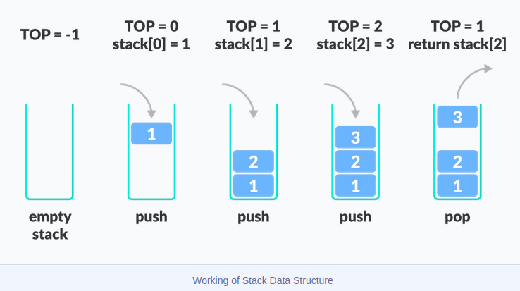

# Stack Data Structure

A stack is a linear data structure that follows the principle of **Last In First Out (LIFO)**. This means the last element inserted inside the stack is removed first.

You can think of the stack data structure as the pile of plates on top of another.

Here, you can:

* Put a new plate on top
* Remove the top plate

And, if you want the plate at the bottom, you must first remove all the plates on top. This is exactly how the stack data structure works.

### LIFO Principle of Stack

In programming terms, putting an item on top of the stack is called **push** and removing an item is called **pop**.

In the above image, although item 3 was kept last, it was removed first. This is exactly how the **LIFO (Last In First Out) Principle** works.

### Basic Operations of Stack

There are some basic operations that allow us to perform different actions on a stack:

* **Push:** Add an element to the top of a stack
* **Pop:** Remove an element from the top of a stack
* **IsEmpty:** Check if the stack is empty
* **IsFull:** Check if the stack is full
* **Peek:** Get the value of the top element without removing it

### Working of Stack Data Structure

The operations work as follows:

1. A pointer called **TOP** is used to keep track of the top element in the stack.
2. When initializing the stack, we set its value to -1 so that we can check if the stack is empty by comparing **TOP == -1**.
3. On pushing an element, we increase the value of **TOP** and place the new element in the position pointed to by **TOP**.
4. On popping an element, we return the element pointed to by **TOP** and reduce its value.
5. Before popping, we check if the stack is already empty
6. Before popping, we check if the stack is already empty

### Stack Time Complexity

For the array-based implementation of a stack, the push and pop operations take constant time, i.e. O(1).

